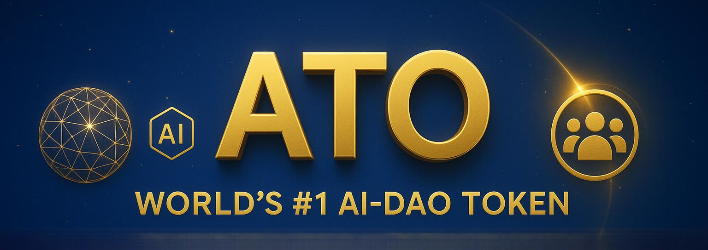

<p align="center">
  
</p>

## Anti Trump Official (ATO)


**Building Bridges, Breaking Chains**  
**A Global Protocol for Civic Power, AI Trust & Decentralized Action**

 [QR Code for Website (PNG)](assets/qr-Web-Site-ATO.png)

---

##  Official Links

- **Website:** [antitrumpofficial.com](https://antitrumpofficial.com)
- **GitHub:** [github.com/antitrumpofficial](https://github.com/antitrumpofficial)
- **Snapshot DAO Voting:** [snapshot.org/#/ato.eth](https://snapshot.org/#/ato.eth)
- **Proposal Submission:** [dao.antitrumpofficial.com/submit](https://dao.antitrumpofficial.com/submit)
- **X (Twitter):** [@ATO_Protocol](https://x.com/ATO_Protocol)
- **Reddit:** [r/ATO_Protocol](https://www.reddit.com/r/ATO_Protocol/)
- **Discord:** [Join Discord](https://discord.gg/Zaf75W3J)
- **Telegram:** [AntiTrumpOfficial](https://t.me/AntiTrumpOfficial)
- **Contact (DAO):** [dao@antitrumpofficial.com](mailto:dao@antitrumpofficial.com)
- **Contact (Info):** [info@antitrumpofficial.com](mailto:info@antitrumpofficial.com)

---

## Why ATO Exists

ATO is the world’s first AI-native, DAO-governed, NGO-integrated civic protocol. We are redefining decentralized governance by connecting blockchain with real humanitarian outcomes — through transparency, automation, and collective action.

It is not just a token. It is a movement, a platform, and a defense mechanism for humanity.

---
## Smart Contract Architecture

**Fully modular, UUPS-upgradeable, and AI-protected:**

| Module                | Proxy Address                                                           | Implementation Address                                 | Explorer                                           | GitHub Source                                                         |
|-----------------------|-------------------------------------------------------------------------|--------------------------------------------------------|----------------------------------------------------|-----------------------------------------------------------------------|
| ATO Token             | [`0xA049...E8A`](https://bscscan.com/address/0xA04973912507064d0E7130b78eb527b68ca04E8A)      | [`0x8dB5...32B`](https://bscscan.com/address/0x8dB57aAb535175b857254DE6D626583658CEf32B) | [View](https://bscscan.com/address/0xA04973912507064d0E7130b78eb527b68ca04E8A)      | [ATO.sol](contracts/core/ATO.sol)                                     |
| AI Guardian           | [`0x8126...eef`](https://bscscan.com/address/0x8126833b3128355A65Bc6416cb08AD4926949eef)      | [`0x62a9...91A`](https://bscscan.com/address/0x62a9eB6281D650829B4cb0F8238362E7f91F491A) | [View](https://bscscan.com/address/0x8126833b3128355A65Bc6416cb08AD4926949eef)      | [AIGuardianUpgradeable.sol](contracts/core/AIGuardianUpgradeable.sol) |
| Staking Engine        | [`0x4A5A...41d`](https://bscscan.com/address/0x4A5A98E56629cfC451eCe4503089DE9856A8841d)      | [`0x2424...FC8`](https://bscscan.com/address/0x242407E74BCeBE2Ef97Fb4845882Fd49d549eFC8) | [View](https://bscscan.com/address/0x4A5A98E56629cfC451eCe4503089DE9856A8841d)      | [ATOStaking.sol](contracts/modules/staking/ATOStaking.sol)            |
| Referral Module       | [`0xDE05...e3D`](https://bscscan.com/address/0xDE055393D97d8b207faA2805319a0366A3631e3D)      | [`0xf9Af...D89`](https://bscscan.com/address/0xf9AfA18E931C161D01F8ab98C6d1eec8E0c59D89) | [View](https://bscscan.com/address/0xDE055393D97d8b207faA2805319a0366A3631e3D)      | [ATOReferral.sol](contracts/modules/referral/ATOReferral.sol)          |
| Civic NFT             | [`0x0d1a...817`](https://bscscan.com/address/0x0d1aDf09d519ADA5F7894ea11Ac86Cc57A3f0817)      | [`0xFD2A...CA3`](https://bscscan.com/address/0xFD2A1Fd0AC58fB517640c3f99ad815F5a279dCA3) | [View](https://bscscan.com/address/0x0d1aDf09d519ADA5F7894ea11Ac86Cc57A3f0817)      | [ATOCivicNFT.sol](contracts/modules/nft/ATOCivicNFT.sol)              |
| NGO Fund              | [`0x6Dc8...895`](https://bscscan.com/address/0x6Dc86480BdAC456F00585e95eFe138E4Bb527895)      | [`0x3e89...E7B`](https://bscscan.com/address/0x3e89312614fe8350f8FAC2Ec1Dc1717F95c25E7B) | [View](https://bscscan.com/address/0x6Dc86480BdAC456F00585e95eFe138E4Bb527895)      | [ATONGOFund.sol](contracts/modules/ngo/ATONGOFund.sol)                |
| Treasury System       | [`0x24Ae...788`](https://bscscan.com/address/0x24AeE1c1CC3FEadEA3f22b98357436cbD42f0788)      | [`0xF0F8...B1D`](https://bscscan.com/address/0xF0F8Ea536f0a50B04ec371cd023fdF7256699B1D) | [View](https://bscscan.com/address/0x24AeE1c1CC3FEadEA3f22b98357436cbD42f0788)      | [ATOTreasury.sol](contracts/modules/treasury/ATOTreasury.sol)         |
| Arbitration Council   | [`0x5bb4...6e6`](https://bscscan.com/address/0x5bb43A0417b2363e79fFaCE25894d1EF1159D6e6)      | [Implementation Unknown/Proxy Only]                                               | [View](https://bscscan.com/address/0x5bb43A0417b2363e79fFaCE25894d1EF1159D6e6)      | [ATOArbitrationCouncil.sol](contracts/modules/arbitration/ATOArbitrationCouncil.sol) |

---

## Tokenomics (Snapshot Overview)

```
Total Supply: 300,000,000 ATO (Fixed, Non-Mintable)
Tax: 1% Total per transaction
- 0.5% Reflection
- 0.25% Auto-Burn
- 0.25% DAO Treasury
Anti-Whale:
- Max 1% per transaction
- Max 2.5% per wallet
```

All values governed and adjustable via DAO proposals.

---

## Governance Engine

ATO combines Snapshot DAO voting with an AI Hook Verification Layer:

1. Proposal created on Snapshot
2. AI Oracle performs sentiment and risk analysis
3. Quorum and approval thresholds checked
4. AI Hook authorizes or blocks on-chain execution

Emergency DAO Circuit Breaker and Guardian Override are built-in.

---

## Wallet Transparency

| Wallet           | Address                                      |
|------------------|----------------------------------------------|
| DAO Treasury     | `0x7eB5D199BaB7BA2b6BbEeF7D07Eea62f2B838548` |
| Charity Wallet   | `0x81C7774e5dC5D099Be29ce861063286620C8192d` |
| Liquidity Wallet | `0xf37a2571dC9a55Ceb3682C3cd4Ffe342c55757a6` |
| Marketing Wallet | `0xf37a2571dC9a55Ceb3682C3cd4Ffe342c55757a6` |
| Deployer Wallet  | `0x616C518dec8BB15E5bFde9EE175c87782490548d` |
| Rewards Wallet   | `0xcfad82FE1Aa5a4c3215180ED77C673A2a223E8Cc` |
| Circulation Pool | `0xCf324C6a0184D001EcA1722EDAF52a93bACcBc0F` |
| Tax Handler      | `0xddb5BaECC32C634A7242c9FeE80493129d9D5aDA` |

---

## Security and Compliance

- Slither Audit Passed
- UUPS Upgradeability
- Multisig Treasury
- Emergency Circuit Breaker
- AI Abuse Detection
- Global KYC and NGO Onboarding Framework

Audit Logs and Proofs: [audit.antitrumpofficial.com](https://audit.antitrumpofficial.com)

---

## Contact and Involvement

- DAO Inquiries: [dao@antitrumpofficial.com](mailto:dao@antitrumpofficial.com)  
- Legal and Licensing: [legal@antitrumpofficial.com](mailto:legal@antitrumpofficial.com)  
- Partnerships: [partners@antitrumpofficial.com](mailto:partners@antitrumpofficial.com)  

---

## Final Statement

ATO is a declaration of digital independence.  
Where systems fail, people rise — powered by code, governed by all, verified by AI.

Forks must preserve open-source license and DAO attribution.

---

“All for All — Not All for One.”
